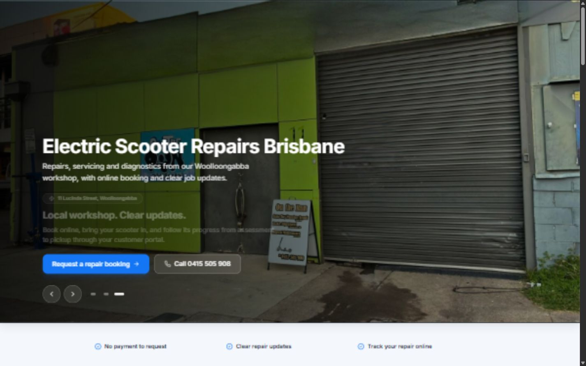
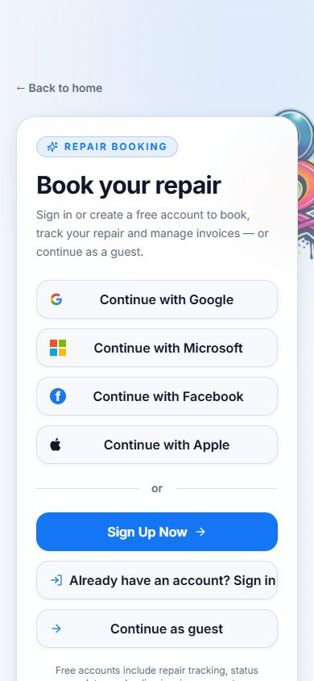
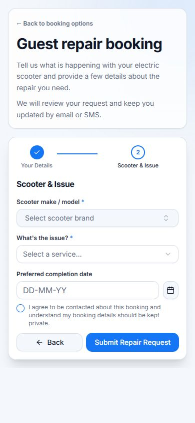
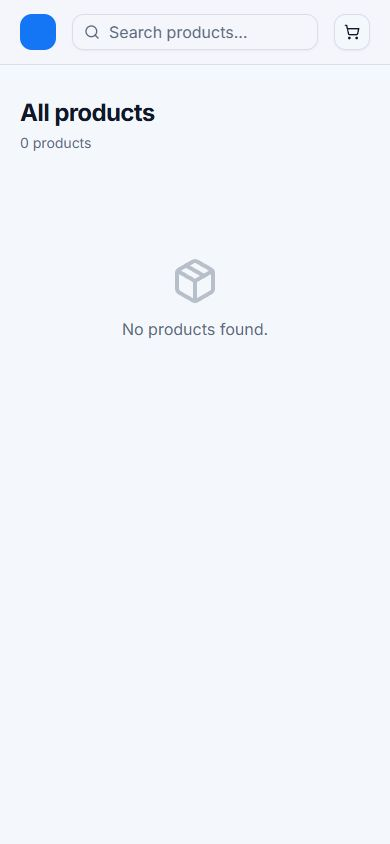
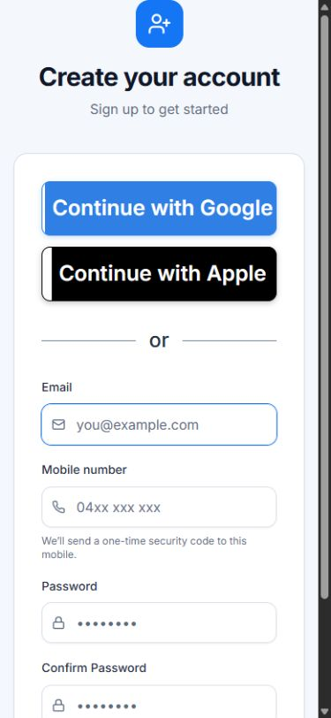
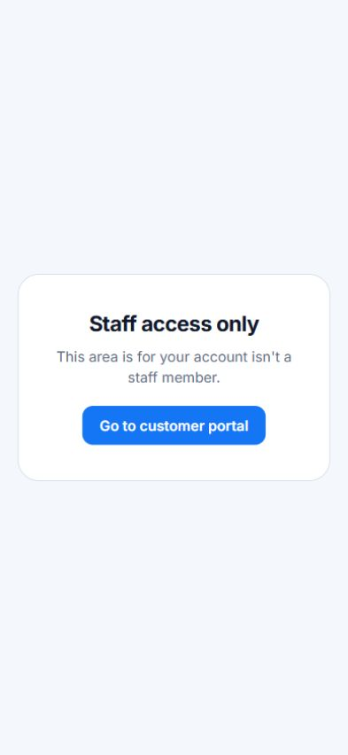

# OTRE UI/UX and Product Review

**Date:** 12 August 2026  
**Source reviewed:** local `main`, matching `origin/main` at `22f1942`  
**Scope:** public marketing, booking and authentication, customer portal, public job tracking, store and checkout, staff operations, admin tools, blog management, shared UI, Base44 entities/functions/workflows, and responsive behavior.

## Review Method And Limitations

- Reviewed the complete route map and the source behind every public, customer, staff, admin, store, blog, settings, and error surface.
- Cross-checked frontend status/configuration assumptions against Base44 entities, functions, and workflows.
- Ran the local app and inspected the main public conversion path at desktop and 390 x 844 mobile sizes.
- `npm run build` passes. `npm run typecheck` and `npm run lint` do not currently pass; type checking produces widespread JSX diagnostics and lint reports 24 unused-import errors.
- Authenticated customer and staff data states could not be exercised end to end because this checkout has no configured Base44 runtime URL or test credentials. Those areas were reviewed statically, including loading, empty, error, and mutation paths.

## Rendered Evidence

1. **Landing, needs work:** strong photography and CTA, but the first viewport has no visible product navigation or persistent brand anchor. Supporting copy loses contrast over the image.

   

2. **Booking entry, at risk:** seven competing account and guest choices make the first commitment step unnecessarily demanding.

   

3. **Guest booking, at risk:** the form is visually compact, but required-field feedback is delayed and fields are not programmatically associated with their labels.

   

4. **Store, at risk:** mobile category navigation disappears, the brand mark becomes a solid blue square, and the empty state offers no recovery action.

   

5. **Registration, at risk:** oversized social sign-in controls push the primary email action below the fold and the later two-stage verification burden is not previewed.

   

6. **Staff route guard, broken copy:** a signed-out visitor is classified as a non-staff account and shown an ungrammatical dead-end message.

   

## 1. Executive Summary

OTRE has a credible visual foundation: real workshop imagery, consistent typography and colour usage, recognisable card and button patterns, and a clear high-level repair-booking proposition. The public home page feels substantially more polished than a default Base44 scaffold.

The product is not yet ready for a dependable end-to-end release. Several issues affect operational or financial trust rather than appearance alone: customer milestones misrepresent ready and cancelled jobs as complete; dashboard counts use obsolete statuses; the invoice `Refund` action does not issue a Stripe refund; and cancelled store payments lose the cart without any return-state feedback. These are priority product defects.

The second systemic problem is incomplete interaction design. Many mutations provide no failure or recovery state, loading often renders as false zero/empty content, form labels are not connected to inputs, and overlays do not manage focus. Mobile layouts are strongest on marketing pages and weakest in staff forms, tables, calendar, and store filtering.

## 2. Main User Flows Discovered

1. **Public discovery:** Home -> Services / Pricing / About / Blog / Contact -> Book a repair.
2. **Guest booking:** Booking account choice -> contact details -> scooter and service details -> consent -> booking reference.
3. **Account creation:** Social or email registration -> SMS verification -> Base44 email OTP -> profile/scooter setup -> customer portal.
4. **Customer self-service:** Portal overview -> scooters -> repair jobs -> invoices -> referrals -> account details/settings -> support.
5. **Public job tracking:** Secure track link -> milestone/status -> notes -> file upload -> invoice/payment.
6. **Staff operations:** Dashboard -> job search/filters -> job detail -> intake/estimate/work/invoice -> customer collection.
7. **Scheduling and inventory:** Calendar -> jobs; Parts -> stock/order/supplier actions; Invoices -> payment and reminder actions.
8. **Administration:** Customers/assets -> feedback/activity -> business settings -> service pricing -> blog/news publishing.
9. **Commerce:** Store discovery/search/category -> cart -> contact/fulfilment form -> Stripe -> success/cancel return.

## 3. UX Strengths

- **Strong proposition and imagery:** `src/pages/Home.jsx` and the landing components use real workshop/scooter imagery and place the repair CTA prominently.
- **Consistent component language:** buttons, inputs, cards, badges, dialogs, and typography generally follow a shared visual system in `src/index.css` and `src/components/ui`.
- **Useful completion feedback:** `src/components/booking/PublicBookingForm.jsx` gives a clear success state and booking reference after submission.
- **Several purposeful empty states:** invoices, parts, feedback, activity, and customer content generally explain when no records exist rather than leaving blank panels.
- **Motion considerations:** the landing carousel and parallax components respect reduced-motion preferences, and carousel controls have descriptive labels.
- **Operational breadth:** the staff product connects jobs, calendar, parts, estimates, invoices, customers, and publishing in one shell; the overall domain model is coherent.
- **Public tracking concept:** `src/pages/PublicTrack.jsx` gives customers a low-friction way to see repair progress without entering the full portal.

## 4. UX Weaknesses

| Severity | Finding | Evidence and impact |
| --- | --- | --- |
| Critical | Customer milestones are factually wrong | `src/components/portal/CustomerJobModal.jsx:14` and `:26` map `ready_for_pickup`, `completed`, and `cancelled` to the same final Complete milestone. Customers can believe unfinished or cancelled work is complete. |
| Critical | Refund is a status change, not a refund | `src/components/dashboard/InvoicePanel.jsx:467` exposes a direct `Refund` action. `base44/functions/invoiceActions/entry.ts:248` only updates invoice/job state and logs the event; it does not call Stripe. |
| High | Dashboard metrics and filters use obsolete statuses | `src/pages/dashboard/Overview.jsx:34` uses `active`, `booked`, `waiting_customer`, and `waiting_parts`, while `src/lib/jobConfig.js:18` defines the current lifecycle. Counts and click-through filters can be zero or wrong. |
| High | Store checkout has no reliable return journey | `src/components/store/CheckoutDialog.jsx:47` clears the cart before payment completes. Stripe returns to `?payment=success/cancelled`, but `src/pages/Store.jsx` never reads it; cancellation loses the cart and no outcome is shown. |
| High | Public navigation is hidden on subpage load | `src/components/landing/LandingNav.jsx:24` reveals navigation only after scrolling when no hero ref exists. About, Contact, Pricing, Blog, and Book can open without visible navigation. |
| High | Business information has multiple conflicting sources | `src/data/contactDetails.js`, `src/lib/platformConfig.js`, hard-coded public copy, and editable BusinessProfile settings disagree on email, hours, and timezone. Staff changes do not reliably affect public pages. |
| High | Failed mutations commonly become silent or permanently busy | Booking, tracking notes/uploads, feedback, signature upload, invoice updates, and blog mutations omit user-facing `catch`/retry handling in multiple flows. |
| Medium | Incomplete product promises are shown as features | Referrals promise 10% off while tracking is “coming soon”; connected social accounts and loyalty copy advertise functionality that is not implemented. |
| Medium | Visual hierarchy is flattened by repeated cards | Most sections use similar white rounded cards, borders, and heading weights, so primary tasks, secondary context, and passive information often look equally important. |

## 5. Navigation Issues

- `LandingNav.jsx` starts hidden and remains hidden on non-home pages until the user scrolls. Navigation and product identity should be visible immediately on every internal public route.
- The landing home link is labelled “On The Road home” in `src/components/landing/LandingNav.jsx:56`, conflicting with On The Run branding.
- `src/components/dashboard/DashboardShell.jsx:22` exposes more than fourteen links with permanently expanded nested groups. Customers, News, and Settings need collapsible groups or clearer role/task grouping.
- Parent sidebar items use exact-path active checks (`DashboardShell.jsx:56` and `:77`), so the parent does not remain active while a child page is open.
- Staff `Settings -> Service Pricing` links to the public `/service-pricing` route. It exits the staff shell and offers no catalogue editing workflow; unused pricing editor components suggest the intended workflow is incomplete.
- `src/pages/PortalAccount.jsx` duplicates scooters and account details already present in portal settings and stacks unrelated content on one long page without section navigation.
- `src/components/DashboardLayout.jsx:28` treats a signed-out visitor as an authenticated non-staff user and renders broken grammar instead of redirecting to sign-in with a return URL.
- `src/pages/NotFound.jsx:55` exposes scaffold/admin language telling users to ask AI to implement the page. This is inappropriate in a production 404.

## 6. Form And Interaction Issues

- The shared booking `Field` in `PublicBookingForm.jsx:278` renders visible labels without `htmlFor`, input `id`, `aria-describedby`, or live error semantics. Validation arrives only after submit.
- The final booking button remains available before scooter, service, and consent requirements are complete. Use inline validation, a concise requirement summary, and focus the first invalid field.
- Guest booking submission (`PublicBookingForm.jsx:118`) has no user-facing failure state. Network or backend failure leaves no actionable recovery path.
- `src/pages/ProfileSetup.jsx:16` silently requires a complete scooter before Continue can activate, but the scooter section is not visibly marked required.
- Registration presents social login plus email, then adds SMS verification and Base44 email verification. The two verification steps and their purpose are not disclosed before the user starts.
- `src/components/portal/SignatureCapture.jsx` is canvas/pointer only, has no accessible name or keyboard alternative, and can remain in a saving state when upload fails.
- Invoice actions in `InvoicePanel.jsx:467` have equal visual weight and include destructive/financial commands without confirmation. Separate primary collection actions from secondary status and destructive actions.
- Clickable invoice rows (`src/pages/dashboard/Invoices.jsx:140`) and picker rows in `PartPickerModal.jsx` / `LabourConsumablePickerModal.jsx` are not keyboard-operable controls.
- Blog publishing controls in `src/pages/dashboard/BlogEditor.jsx:44` combine draft, publish, schedule, status, and date without clear state, validation, confirmation, or mutation feedback.
- Taxonomy editing in `src/pages/dashboard/BlogTaxonomy.jsx:16` loads an item into a form whose CTA still says Create category, with no edit mode or cancel/reset affordance.

## 7. Mobile And Responsive Issues

- Mobile store categories disappear because the category rail is hidden below `lg` in `src/pages/Store.jsx:83` and no replacement menu/chips are provided.
- The mobile store logo and feedback icon become blue-on-blue: their parent uses `bg-primary` while the icon uses `text-accent`, and both tokens resolve to `#1476F5`.
- Cart increment/decrement controls are 28 x 28 px in `src/components/store/CartDrawer.jsx:38`, below a comfortable 44 x 44 px touch target.
- Staff forms retain fixed two-column grids and 28-32 px controls in `CustomerEditPanel.jsx`, `AssetIntakeForm.jsx`, `AssetEditDialog.jsx`, `CreateJobModal.jsx`, and `IntakePanel.jsx`; fields will crowd and labels/actions become hard to tap.
- Calendar defaults to a dense week view and converts the week to a two-column mobile grid. In `src/pages/dashboard/Calendar.jsx:85`, week navigation changes the displayed week without synchronising `selectedDay`, so the daily date and jobs can disagree.
- The admin client table has nine columns and horizontal overflow without a mobile card/summary alternative; row selection checkboxes are also unlabelled.
- Registration’s oversized 64 px social buttons dominate the initial mobile viewport and push the email submit action below the fold.
- `index.html` references `/manifest.json`, but no public manifest exists, weakening installability and mobile browser metadata.

## 8. Accessibility Concerns

- A scan found 106 `<Label>` usages without an explicit `htmlFor`; representative issues appear in booking, checkout, customer edit, asset intake, and profile forms.
- Primary blue `#1476F5` is approximately 4.25:1 against white and 3.96:1 against the app background, below WCAG AA for normal-size text. Several primary buttons and text links rely on this pairing.
- No skip link is present, increasing keyboard effort on long public and dashboard pages.
- Invoice table rows and part/labour result `
` elements rely on pointer clicks without role, tab stop, or Enter/Space handling.
- The portal tutorial, mobile navigation drawer, and other custom overlays do not expose dialog semantics, trap focus, restore focus, or consistently support Escape.
- Loading spinners and inline errors often lack `role="status"`, `role="alert"`, or live regions. Screen-reader users may not know a request completed or failed.
- Signature capture requires pointer drawing; there is no typed-name or assisted alternative.
- Dashboard charts do not provide a textual/table equivalent for the values they visualise.
- Hero text is placed over changing photography; contrast varies by slide and the body copy is visibly weak on lighter/busier image areas.

## 9. Recommended UI Improvements

1. **Create one canonical job-status model.** Derive dashboard metrics, filters, customer milestones, badges, and actions from `jobConfig.js`; define explicit treatment for cancelled and ready-for-pickup states.
2. **Repair financial semantics.** Rename status-only actions, implement a real confirmed Stripe refund flow if required, and provide receipt/result/error states for every payment action.
3. **Make navigation persistent and role-aware.** Show the public header immediately, simplify the staff sidebar into collapsible task groups, preserve parent active state, and guard staff routes with sign-in/return behavior.
4. **Standardise async UX.** Every query and mutation should support loading, success, empty, error, retry, and disabled states through shared components; never render temporary zero metrics as real data.
5. **Build an accessible field primitive.** Generate stable IDs, connect labels/help/errors, expose required state, announce errors, and focus the first invalid input. Migrate booking and checkout first.
6. **Streamline booking onboarding.** Lead with one recommended action, place Sign in as a secondary path, group social providers behind Continue another way, and disclose verification steps before registration begins.
7. **Fix store continuity.** Persist the cart, retain it on cancellation, read Stripe return parameters, state shipping cost/timing before payment, and add a mobile category selector plus actionable empty states.
8. **Unify business settings and branding.** Make BusinessProfile the public source for email, phone, hours, timezone, and identity; remove On The Road / OTR Scooters / On The Run conflicts.
9. **Adopt responsive staff patterns.** Collapse form grids at small breakpoints, replace wide tables with summary rows/cards, increase touch targets, and make day view the practical mobile calendar default.
10. **Hide or clearly label incomplete features.** Do not promise referral discounts, connected accounts, or loyalty until tracking, terms, and fulfilment are ready.

## 10. Priority Improvement List

| Priority | Work | Definition of done |
| --- | --- | --- |
| P0 | Correct milestone/status logic | One canonical status map drives staff metrics, filters, and customer progress; cancelled is never shown as complete; tests cover every lifecycle status. |
| P0 | Correct refund and payment behavior | Refund either calls Stripe with confirmation and outcome messaging or is renamed as an internal status action; permissions and audit details are explicit. |
| P0 | Repair store checkout return flow | Cart persists through redirect, cancellation restores checkout context, success/cancel/error banners render, shipping expectations are accurate, and duplicate submission is prevented. |
| P1 | Accessible forms and async feedback | Booking, checkout, profile, invoice, tracking, signature, and blog actions have associated labels, inline/live errors, retry, pending disablement, and success confirmation. |
| P1 | Navigation and route protection | Public nav is visible on entry, staff routes redirect unauthenticated users, sidebar groups/active states work, and pricing administration remains inside the staff shell. |
| P1 | Canonical business configuration | Public contact details/hours/timezone and admin settings read/write the same source and all legacy brand copy is removed. |
| P1 | Mobile operations pass | Staff grids collapse cleanly, wide tables have mobile alternatives, calendar day selection stays correct, store filters are available, and primary controls meet 44 px targets. |
| P2 | Simplify onboarding and portal IA | Booking presents fewer initial choices; verification is previewed; portal Account/Settings ownership is clear; tutorial is accessible and resumable. |
| P2 | Strengthen hierarchy and empty states | Primary tasks are visually distinct, card repetition is reduced, charts have text summaries, and search/filter empty states offer clear recovery actions. |
| P2 | Remove incomplete promises | Referral, loyalty, social account, scheduling, and taxonomy surfaces are either complete with terms/states or hidden until ready. |

## Suggested Delivery Sequence

- **Sprint 1:** P0 status, milestone, refund, and store checkout defects; add regression tests.
- **Sprint 2:** booking/checkout accessibility and async-state primitives; public navigation and route protection.
- **Sprint 3:** canonical business configuration, mobile staff layouts, calendar, and store filtering.
- **Sprint 4:** onboarding simplification, portal IA, blog/admin polish, visual hierarchy, and incomplete-feature cleanup.
